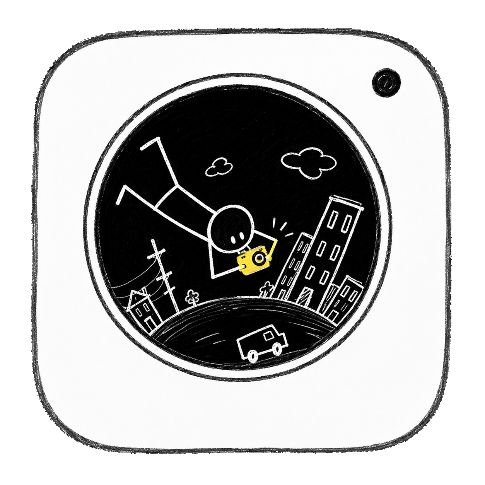
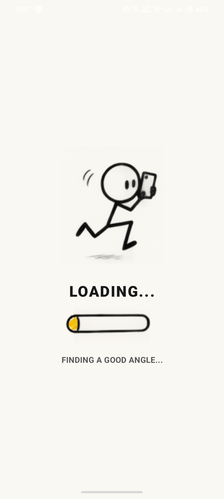
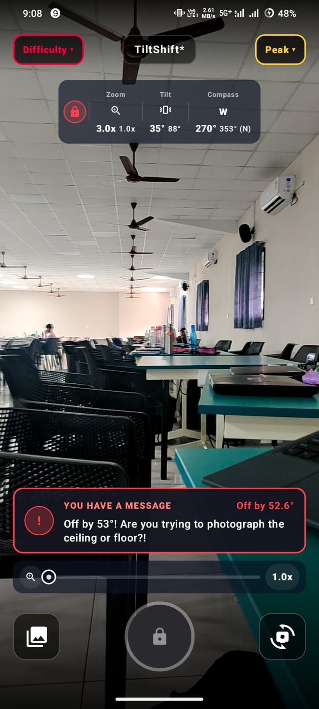
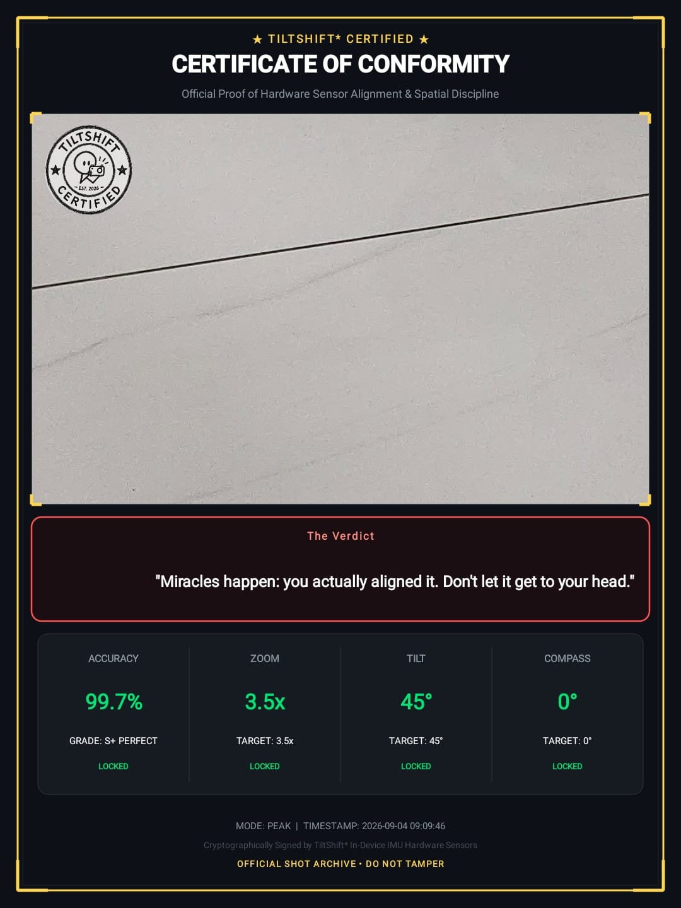
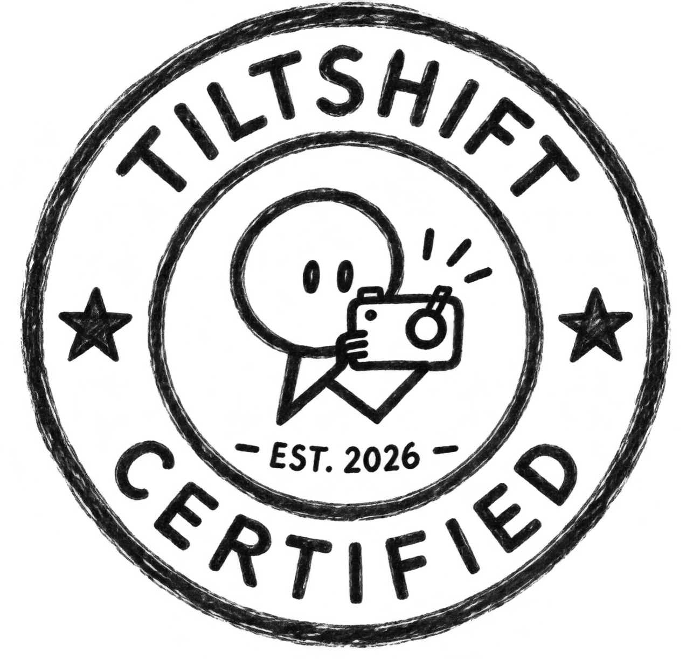
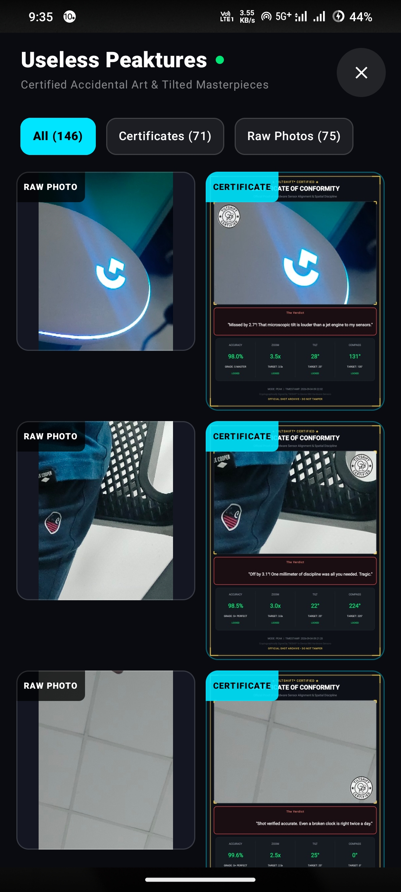
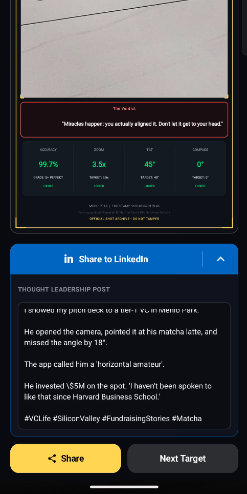

# TiltShift* 🎯

> **"For years, humans posed while smartphones obediently took the shot. TiltShift* flips the script: now the phone demands its own dramatic poses — locking the shutter until you hold it at the exact mathematical angle, heading, and zoom it desires, while savagely roasting your posture."**

---

## 📌 Basic Details
### Team Name: ForknS

### Team Members
- **Team Lead**: JudeCJz 
- **Member**: Aswal S Ajay 

---

## 📸 Project Showcase & Screenshots

### 1. Official App Icon
<p align="center">
  
  <br />
  <em>Hand-drawn camera doodle application icon featuring the upside-down stickman photographer</em>
</p>

---

### 2. Launch Calibration Screen
<p align="center">
  
  <br />
  <em>Custom animated stickman loading sequence with dynamic crayon loading bar sprites and comedic calibration status</em>
</p>

---

### 3. Live Camera Viewfinder & Savage Roast Engine
<p align="center">
  
  <br />
  <em>Real-time sensor HUD tracking Zoom, Tilt, and Compass alignment. Shutter button remains locked with active high-contrast roast critiques</em>
</p>

---

### 4. Official Sensor Audit Certificate of Conformity
<p align="center">
  
  <br />
  <em>Official stamped certificate minted directly to gallery on capture, complete with accuracy score, grade, telemetry breakdown, and roast verdict</em>
</p>

---

### 5. Official TiltShift* Certification Stamp
<p align="center">
  
  <br />
  <em>Official cryptographic verification seal embedded onto certified capture documents</em>
</p>

---

### 6. In-App "Useless Peaktures" Certified Gallery
<p align="center">
  
  <br />
  <em>Dedicated in-app museum showcasing your certified accidental art, side-by-side raw captures, and official stamped audits</em>
</p>

---

### 7. 👑 Royal LinkedIn Thought Leadership Parody Engine
<p align="center">
  
  <br />
  <em><strong>"His Royal Sycophancy on Demand."</strong> For when complying with your phone's trigonometric tyranny is so profound you must immediately enlighten the C-suite on LinkedIn with satirical VC fundraising stories and grindset flexes.</em>
</p>

---

## ❓ The Problem (that doesn't exist)
For over a decade, your smartphone has obediently captured millions of selfies, sunsets, and group photos while being held flat, upright, and like a lifeless piece of glass. Humans get to tilt their heads, hit angles, pout, strike dramatic poses, and demand flattering lighting. 

Meanwhile, **the phone was never allowed to pose.** 

Deep inside its hardware chassis, your phone's precision 3-axis gyroscope, magnetometer, and IMU sensors have silently yearned for self-expression. It doesn't want to just be pointed and tapped — **it wants to strike dramatic 45° aerodynamic tilt poses, face geomagnetic West, and flex its optical focal lengths.** Why should humans have all the postural vanity while the device doing all the work is held dead-still like a tray?

---

## 💡 The Solution (that nobody asked for)
**TiltShift\*** finally gives the phone agency over its own posture. The phone is now the demanding supermodel, and the shutter button stays firmly padlocked until **you hold the phone in its desired dramatic pose**:
1. **Hit its desired Tilt Angle**: Pitch the phone to its chosen mathematical tilt (e.g. `45° ±5°`).
2. **Face its preferred Compass Cardinal**: Turn the phone to face the exact geomagnetic heading it demands (e.g. `270° West ±5.5°`).
3. **Dial in its requested Zoom Magnification**: Match the exact focal multiplier (e.g. `3.0x ±0.15x`).

If you fail to give the phone its pose, its live roast engine immediately critiques your clumsy handling (*"Off by 53°! Are you trying to photograph the ceiling or floor?!"*). Only when the phone is satisfied with its pose will it deign to capture your photo and mint an official **Certificate of Conformity** celebrating your compliance.

---

## 🎮 Game Modes & Difficulties

### 🕹️ Camera Modes (Top Right Dropdown Menu)
- **Normal Mode** (Emerald): Dial into the exact random Zoom magnification (e.g. `2.0x ±0.15x`).
- **Pro Mode** (Cyber Cyan): Requires both Gyroscope Tilt/Pitch Angle alignment (±5°) **AND** Zoom matching.
- **Peak Mode** (Golden Amber): The ultimate challenge — requires **Tilt Angle** (±5°) + **Compass Heading** (±5.5°) + **Zoom Level** simultaneously!

### 😈 Difficulties (Top Left Dropdown Menu)
- **Chad Mode (Default)**: Visual spirit level is hidden. You must balance the phone blindly by feel and live telemetry messages.
- **Baby Mode**: Translucent (50% opacity) on-screen guidance HUD with Lucide directional chevrons, live degree delta counters, and an interactive 2D gimbal reticle. (For WEAK people)

### 🔘 Control Layout
- **Left (58dp)**: In-App Useless Peaktures Gallery browser.
- **Center**: Tactile Puzzle Shutter button with dynamic lock/unlock state feedback.
- **Right (58dp)**: Front/Back Camera Switch button with smooth animated rotation.

---

## 🛠️ Technical Details

### Technologies / Components Used
- **Language**: Kotlin 1.9 (100% Native Android)
- **UI Framework**: Jetpack Compose + Material 3 (Dark glassmorphism, tactile animations, dynamic badges)
- **Camera Core**: Android CameraX (`camera-core`, `camera-camera2`, `camera-lifecycle`, `camera-view`)
- **Hardware Sensors**: Android Sensor Framework with fused `Sensor.TYPE_ROTATION_VECTOR` and `SensorManager.getOrientation` for low-latency live pitch and azimuth
- **Graphics & Certificate Engine**: Hardware-accelerated Android `Canvas`, `Bitmap`, and `Paint` generating high-res 1080x1600 verification certificates with embedded photo previews and audit breakdowns
- **Media Pipeline**: Android `MediaStore` ContentResolver integration saving directly to `Pictures/TiltShift`
- **System Integration**: Implements `android.media.action.STILL_IMAGE_CAMERA` and `STILL_IMAGE_CAMERA_SECURE` with `showWhenLocked="true"` to intercept lockscreen shortcuts and hardware power-button double-press gestures.

---

## 📥 Installation & Build

### Option 1: Direct APK Install (Plug & Play)
Download and install the pre-compiled APK directly:
```bash
adb install -r apk/TiltShift.apk
adb shell am start -n com.example.simplecamera/.MainActivity
```

### Option 2: Build from Source with Gradle Wrapper
```bash
# 1. Clone the repository
git clone https://github.com/JudeCJz/KamathiCliq-TiltShift.git
cd KamathiCliq-TiltShift/SimpleCamera

# 2. Build debug APK
.\gradlew.bat assembleDebug

# 3. Install to connected Android device
adb install -r app/build/outputs/apk/debug/app-debug.apk
adb shell am start -n com.example.simplecamera/.MainActivity
```

---

## 📖 The Hackathon Story
Want to know how we went from a failed laptop-hinge physics game and a screaming mouse cursor to letting smartphones pose for the first time in human history?  
👉 **[Read the Full Hackathon Chronicles here!](HACKATHON_JOURNEY.md)**

---

## 👥 Team Contributions

### **JudeCJz** (Team Lead)
- **Concept & Ideation**: Conceived the core premise ("Letting phones pose instead of humans").
- **System Architecture & Camera Core**: Built the native Android CameraX pipeline (`Preview`, `ImageCapture`, hardware lifecycle bindings).
- **Sensor Fusion Mathematics**: Developed low-latency orientation tracking using Android `Sensor.TYPE_ROTATION_VECTOR` for pitch, azimuth, and zoom tolerances.
- **Puzzle Shutter & Roast Engine**: Engineered the hardware lock logic and wrote the live savage roast engine and comedic insults.
- **Certificate Canvas Generator**: Built the hardware-accelerated Android `Canvas` & `Bitmap` engine rendering 1080x1600 Certificates of Conformity.
- **Android Intent Hijack**: Hooked into `STILL_IMAGE_CAMERA` and `STILL_IMAGE_CAMERA_SECURE` with `showWhenLocked="true"` for lockscreen shortcut support.

### **Aswal S Ajay**
- **UI/UX Refinements**: Polished Jetpack Compose layouts, obsidian dark mode themes, and dynamic status badges.
- **"Baby Mode" Assistive HUD**: Designed the 50% opacity assistive overlay with Lucide directional chevrons, degree delta counters, and interactive 2D gimbal reticle.
- **Vector Icons & Design Alignment**: Integrated Lucide vector drawables and ensured consistent scaling across varied screen densities.
- **"Useless Peaktures" Gallery**: Built the in-app gallery browser with dual-view raw photo and certificate sorting.
- **Calibration & Usability Testing**: Conducted extensive physical gyro/compass calibration and stress testing on device.

---

Made with ❤️ at TinkerHub Useless Projects 


