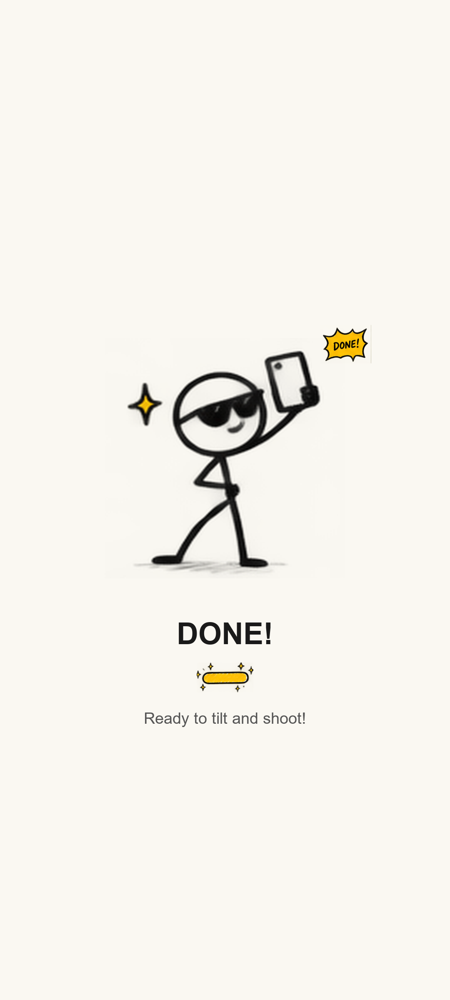
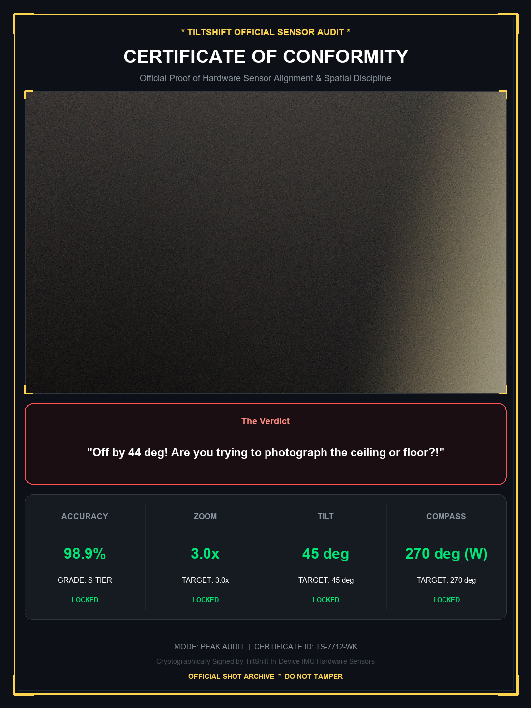
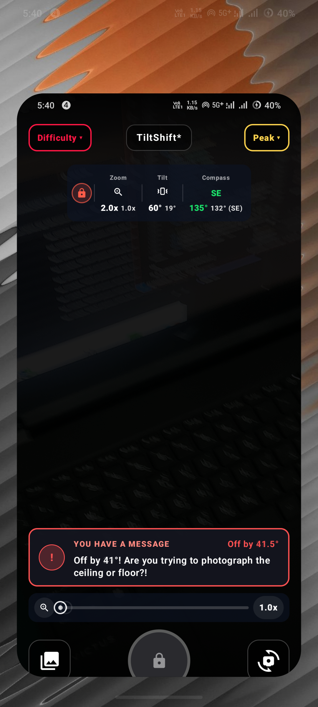
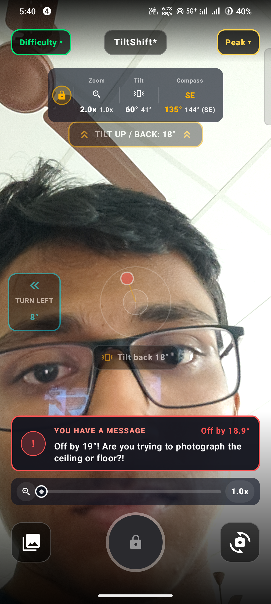
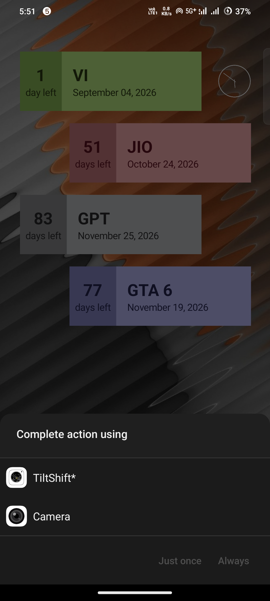

# TiltShift* 🎯

> **"A camera app that aggressively refuses to take photos until you hold your phone at an absurdly specific mathematical angle, compass heading, and zoom magnification — then savagely roasts your posture."**

---

## Basic Details
### Team Name: TinkerLess

### Team Members
- Team Lead: JudeCJz - TinkerHub

---

## Project Description
**TiltShift\*** is an over-engineered, frustratingly precise Android camera app built natively with **Jetpack Compose** and **CameraX**. Instead of simply tapping a shutter button to capture life's moments, **TiltShift\*** padlocks the shutter behind real-time hardware gyroscope, geomagnetic compass, and digital zoom constraints. 

If your phone is tilted even slightly off the target degree, the camera remains locked and displays live, savage roasts mocking your unsteady hands. Once you finally satisfy the celestial alignment gods, it captures your photo and mints an official, cryptographic **TiltShift\* Sensor Audit Certificate** with your accuracy grade and stamped roast verdict directly into your gallery!

---

## The Problem (that doesn't exist)
Modern smartphone cameras have made photography far too effortless. Point, tap, shoot. Anyone can do it. Society has completely lost respect for the sacred geometry of gyroscope pitch, geomagnetic azimuth, and optical zoom ratios. Casual photographers capture memories with crooked horizons, trembling hands, and zero regard for spatial trigonometry.

---

## The Solution (that nobody asked for)
**TiltShift\*** brings back the discipline. The shutter button stays padlocked until you:
1. **Tilt your phone** to the exact mathematical degree requested (e.g. `45° ±5°`).
2. **Face the required compass heading** (e.g. `180° South ±5.5°`).
3. **Dial in the exact zoom multiplier** (e.g. `2.4x ±0.15x`).

### Key Features
- 😈 **Chad Mode by Default**: Blind mode with all visual spirit levels hidden — you have to feel the balance in your wrists!
- 👶 **Baby Mode (Half-Transparent Assists)**: 50% opacity translucent assistive HUD with Lucide vector arrows, live degree counters, and an interactive 2D gimbal reticle.
- 💀 **Live High-Contrast Savage Roasts**: Real-time insults rating your crooked posture (e.g. *"Off by 14°! Are you trying to photograph the ceiling?!"* or *"My grandma tilts straighter than this"*).
- 🏆 **Dual Gallery Save**: Saves the raw JPEG alongside an official, stamped **TiltShift\* Sensor Audit Certificate** featuring your accuracy score (`99.2%`), rank grade (`S+ PERFECT`), and audit verdict.
- 🎨 **Goofy Stickman Splash Screen**: Custom hand-drawn stickman photographer with dynamic crayon loading bar sprites and comedic calibration status messages.
- 🖼️ **In-App Useless Peaktures Gallery**: Dedicated gallery browser to view your certified captures, accuracy grades, and share them directly.
- ⚡ **Hardware Camera Shortcut Hijack**: Hooks into Android's `STILL_IMAGE_CAMERA` and `STILL_IMAGE_CAMERA_SECURE` intents with `showWhenLocked="true"`. Double-clicking your phone's power button or swiping from the lockscreen launches TiltShift* instead of your stock camera!

---

## Game Modes & Difficulties

### 🎮 Camera Modes (Top Right Dropdown Menu)
- **Normal Mode** (Emerald): Dial into the exact random Zoom magnification (e.g. `2.0x ±0.15x`).
- **Pro Mode** (Cyber Cyan): Requires both Gyroscope Tilt/Pitch Angle alignment (±5°) **AND** Zoom matching.
- **Peak Mode** (Golden Amber): The ultimate challenge — requires **Tilt Angle** (±5°) + **Compass Heading** (±5.5°) + **Zoom Level** simultaneously!

### 😈 Difficulties (Top Left Dropdown Menu)
- **Chad Mode (Default)**: Visual spirit level is hidden. You must balance the phone blindly by feel.
- **Baby Mode**: Semi-transparent (50% alpha) on-screen guidance HUD with Lucide directional chevrons, tilt/turn degree counters, and 2D gimbal reticle.

### 🔘 Bottom Controls (Symmetric Layout)
- **Left (58dp)**: Useless Peaktures Gallery button
- **Center**: Tactile Puzzle Shutter button with dynamic lock/unlock state feedback
- **Right (58dp)**: Front/Back Camera Switch button with smooth 180° animated rotation

---

## Technical Details

### Technologies / Components Used
- **Language**: Kotlin (100% Native Android)
- **UI Framework**: Jetpack Compose + Material 3 (Dark glassmorphism, tactile animations, dynamic badges)
- **Camera Core**: Android CameraX (`camera-core`, `camera-camera2`, `camera-lifecycle`, `camera-view`)
- **Hardware Sensors**: Android Sensor Framework with fused `Sensor.TYPE_ROTATION_VECTOR` and `SensorManager.getOrientation` for low-latency live pitch and azimuth
- **Graphics & Certificate Engine**: Android `Canvas`, `Bitmap`, and `Paint` generating high-res 1080x1600 verification certificates with embedded photo previews and audit breakdowns
- **Media Pipeline**: Android `MediaStore` ContentResolver integration saving directly to `Pictures/TiltShift`

---

## Project Documentation & Previews

### 1. Official App Icon

*Official TiltShift* Doodle Camera App Icon*

### 2. Launch Calibration Screen

*Hand-drawn stickman photographer with crayon loading bar sprites*

### 3. Cryptographic Sensor Audit Certificate

*Official stamped sensor audit card featuring accuracy grade, sensor telemetry, and roast verdict*

### 4. Live Viewfinder - Chad Mode (Default)

*Symmetric UI with Top-Right Mode dropdown, Bottom-Right Camera Switch, and live roast feedback*

### 5. Live Viewfinder - Baby Mode (Half-Transparent Assists)

*Half-transparent guidance HUD with 2D gimbal reticle, directional arrows, and turn indicators*

### 6. Hardware Camera Shortcut Hijack

*Registers as a system camera provider to intercept hardware power double-press and lockscreen swipes*

---

## Implementation & Installation

### Option 1: Direct APK Install (Plug & Play)
Download and install the pre-compiled APK directly:
```bash
adb install -r apk/TiltShift.apk
adb shell am start -n com.example.simplecamera/.MainActivity
```

### Option 2: Build from Source with Gradle Wrapper
```bash
# 1. Clone the repository
git clone https://github.com/JudeCJz/TinkerLess.git
cd TinkerLess/SimpleCamera

# 2. Build debug APK
./gradlew assembleDebug

# 3. Install to connected Android device
adb install -r app/build/outputs/apk/debug/app-debug.apk
adb shell am start -n com.example.simplecamera/.MainActivity
```

---

## Project Demo
### Video Demonstration
- **Demo Video Link**: *[Add your demo video / YouTube / Drive link here]*
- *Demonstration of sensor alignment lock, live roast banner feedback, Baby Mode translucent 2D gimbal, and dual-file gallery certification generation.*

---

## Team Contributions
- **JudeCJz**: Ideation, architecture, CameraX integration, sensor fusion mathematics, Jetpack Compose UI design, certificate generator canvas, and savage roast copywriting.

---
Made with ❤️ at TinkerHub Useless Projects 


